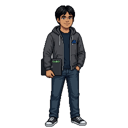

# Hi, I'm Nikko (Niks) 👋

  

## 👨‍💻 About Me

Hi! I'm **Nikko Aldren (Niks)**, a BSIT student and aspiring developer interested in building websites, applications, and software systems.

## 🚀 Tech Stack

### Frontend

   

**React.js • Tailwind CSS • Figma • HTML • CSS • JavaScript**

### Backend

  

**Laravel • PHP • Python • Flask**

### Database

  

**MySQL • XAMPP • phpMyAdmin**

---

# 📂 Projects

### 🎮 Project World Roleplay

A website created for **Project World Roleplay**, a SA:MP roleplay server, designed to present the server and its features through a modern web interface.

**Tech Stack:** `HTML` `CSS` `JavaScript` 

---

### 📦 Warehouse Management System

A simple **Python-based warehouse management system** that runs through the terminal without a frontend interface.

**Tech Stack:** `Python` 

---

### 💎 JavaLuxe

A modern **frontend website design** created for JavaLuxe, focusing on the visual presentation and user interface of the website.

**Tech Stack:** `Java` 
